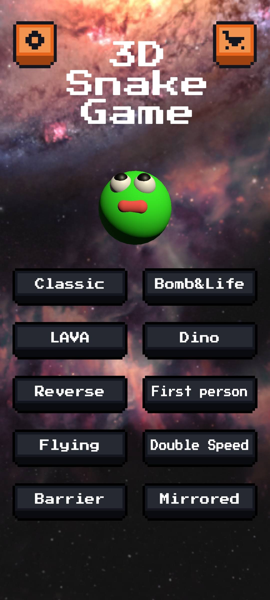
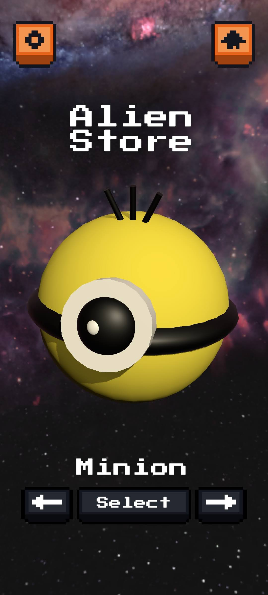
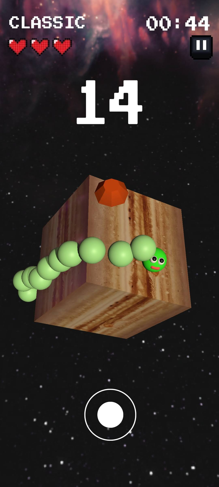
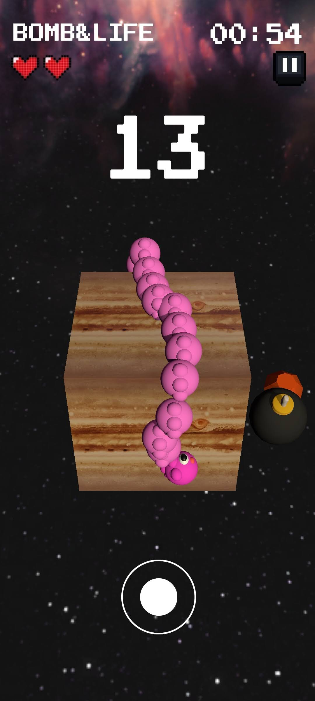

# 3D Snake Game (3D貪食蛇)

作為經典手機遊戲的代表，貪食蛇歷經數十年仍廣受喜愛。我們結合經典玩法與創新元素，打造一款直觀操作、角色多樣、模式豐富的3D貪食蛇遊戲，帶來全新體驗。
<table>
  <tr>
    <td align="center">
      <br>
      <small>遊戲首頁</small>
    </td>
    <td align="center">
      <br>
      <small>商店</small>
    </td>
  </tr>
  <tr>
    <td align="center">
      <br>
      <small>CLASSIC模式</small>
    </td>
    <td align="center">
      <br>
      <small>BOMB&LIFE模式</small>
    </td>
  </tr>
</table>

## Gameplay & Controls
- 操縱虛擬搖桿，控制在立體方塊上的貪食蛇。
- 可以在Store選擇喜愛的角色。
- CLASSIC mode: 在撞擊身體三次之前，獲得高分！
- BOMB & LIFE mode: 躲避炸彈、吃生命值，以獲得高分！  
  
  
## Team Members

| 姓名 | 學號 | 負責項目 |
|------|------|----------|
| 謝鴻恩 | 110034044 | 關卡設計、UI、音效|
| 趙欣榆 | 111034009 | 遊戲主程式、UI |
| 林映帆 | 112590019 | 特效 |  
  

## Tools Used
- Unity 2022.3.58f1  
- C#  
- Android Build Support  
- Unity Asset Store free packages  
  

## Installation
1. 安裝 Unity（版本需支援 Android Build）
1. Clone 此專案：
   ```bash
   git clone https://github.com/HsinYuChao/3D-Snake-Game.git
1. 使用 Unity Hub 開啟專案
1. 切換平台至 Android 並建置 APK
1. 或點擊 [下載 3DSnakeGame.apk](https://github.com/HsinYuChao/3D-Snake-Game/releases/download/v1.0/3DSnakeGameApp.apk)
> *備註：此 APK 檔案已上傳至本專案的 GitHub Release 頁面。*

## Notes
- 本遊戲為國立清華大學《行動平台應用程式設計與創作》的期末專案，僅作為學術展示用途。
- 專案內容不作任何商業用途，所有素材來源皆遵循授權規範。